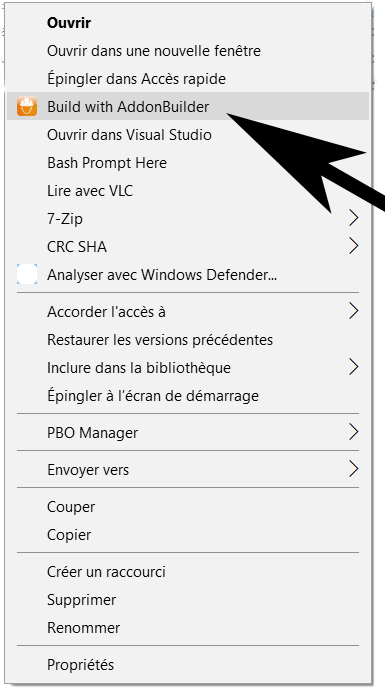

# Build-with-AddonBuilder
I always found that AddonBuilder was missing the possibility to build from the contextual menu.

## Configuration
1. :open_file_folder: Edit install-BuildWithAB.bat with any text editor
2. :pencil2: Modify AddonBuilder executable path line 9
3. :floppy_disk: Save and close the file

## Install
Run as administrator
```
.\install-BuildWithAB.ps1
```

## Uninstall
Run as administrator
```
.\uninstall-BuildWithAB.ps1
```

## Usage
Right click on any folder you want to build into PBO.

### Build options
- [x] binarize (default)
- [ ] packonly
- [x] clear
- [x] temp (default)
- [ ] prefix
- [ ] project
- [ ] sign
- [x] include
- [x] cfgconvert (default)
- [x] filebank (default)
- [x] dssignfile (default)

### Link types
To add or remove types to your build session, edit types_included.txt in the data folder then reinstall via the scripts.

Refer to [AddonBuilder's documentation](https://community.bistudio.com/wiki/Addon_Builder) for formating the string.

## Author
* **Lyeed** - [Lyeed](https://github.com/Lyeed)
