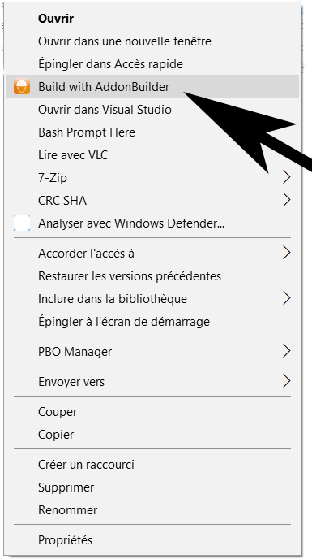

# Build-with-AddonBuilder
I always found that AddonBuilder was missing the possibility to build from the contextual menu.
PboManager has this possibility and I wanted it for Addonbuilder since Bohemia has changed the way Pbos are build.

## Installation
:warning: If AddonBuilder is not installed on the common folder :warning:
```
C:\Program Files (x86)\Steam\steamapps\common\Arma 3 Tools\AddonBuilder\AddonBuilder.exe
```
Steps to update Addonbuilder path :
1. :open_file_folder: Open Install.bat with any text editor
2. :pencil2: Line 5 put your AddonBuilder executable path
3. :floppy_disk: Save and close

Start installation by launching 
```
Install.bat
```

## Uninstallation
Uninstall the contextual menu items and the temporary files in AppData using
```
Uninstall.bat
```

## Usage ?
Right click on the folder you want to build. It will create a Pbo in the parent folder.
If you want to pack without binarising, shift + right click on the folder.

## Author

* **Lyeed** - [Lyeed](https://github.com/Lyeed)
